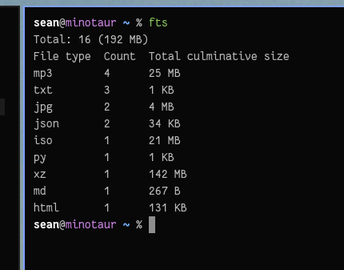

# go-fts

Search through a file system and count up all the file types.

Pretty proud of this little thing.

By default searches current directory but with `-r` will do recursive search. A
few bugs with recursive, such as not filtering out hidden stuff, but all round pretty neato.
